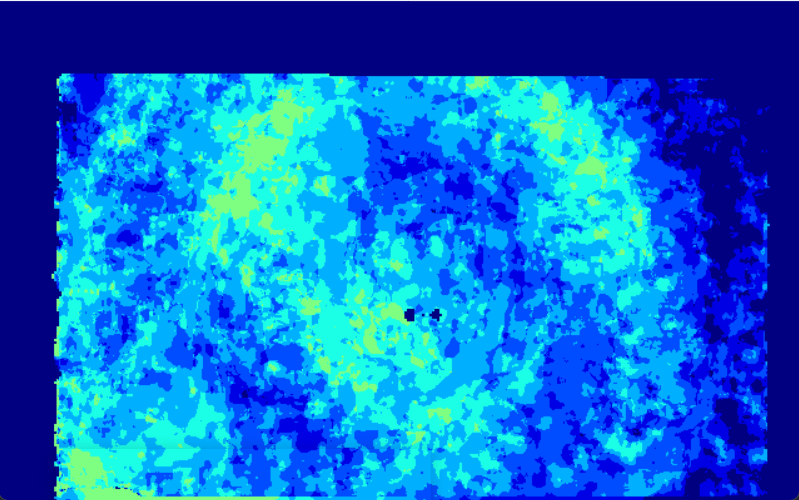
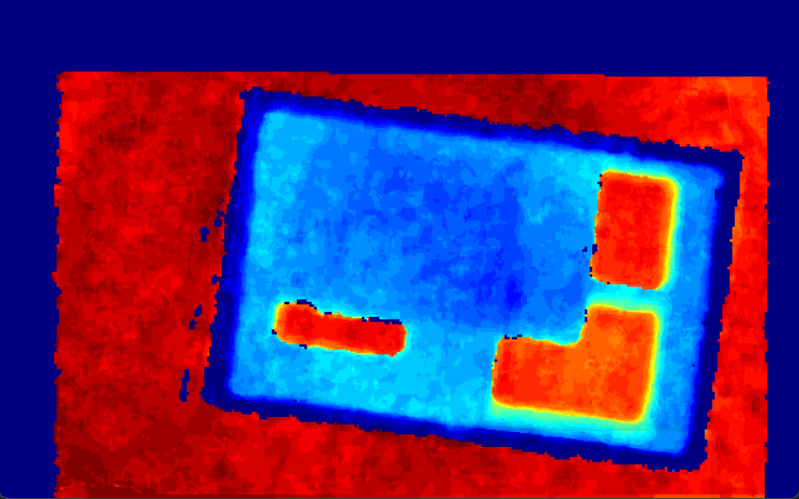

# 本文是写如何显示点云数据
- 未成功可视化不可以用
## 使用的第三方库 PCL库，这些最后都没有成功，可以直接跳到我们的point_cloud_node.cpp文件
```bash
# 安装PCL开发库
sudo apt install libpcl-dev pcl-tools
# ROS2 PCL接口包
sudo apt install ros-humble-pcl-conversions ros-humble-pcl-ros
```
## 在cmakelist.txt和package.xml里面需要添加PCL支持
- cmake
```cmake
find_package(PCL  REQUIRED)

```
- package.xml
```xml
<depend>pcl_conversions</depend>
<depend>pcl_ros</depend>
```
## 编译出现这个警告正常
** WARNING ** io features related to pcap will be disabled
因为我们不使用网络数据包
## 必须在本机上运行这个节点，防止出现显示的问题
发现显示出现问题了.
## 下面是解决这个问题的方案
## 后面使用的是point_cloud_node.cpp文件
这个文件没有使用PCL库，做了手动的点云数据的可视化处理
点云数据的处理使用claude来帮助我们处理，因为我们自己手动的会发现我们的点云数据是全黑的，所以我们需要使用claude来帮我们处理

下面是源码
[claude](./src/point_cloud_node.cpp)
## 运行出现显示点云数据的命令
```bash
ros2 run grab_demo point_cloud_node
```
## 运行结果
如下图所示

下面放了一个盒子的点云数据


这个还挺明显的


